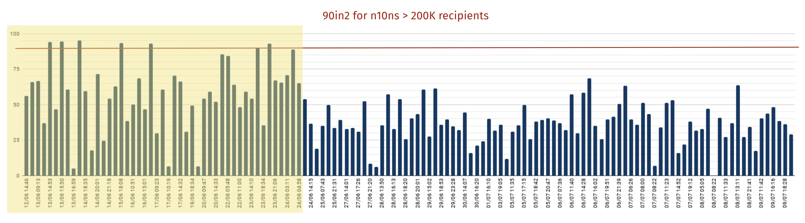

# Shard Size

We explored ways of optimising the mobile notification delivery pipeline.

One suggestion was to increase the shard size so that the batch of notification requests increases in terms of the number of device tokens, thus reducing the overall number of batches. 

The theory was that, as a result, the harvester lambdas would make fewer connections to the registrations db (as well as execute fewer SQL queries).

We doubled the shard size from 10,000 to 20,000 in [this](https://github.com/guardian/mobile-n10n/pull/659) PR.

We evaluated our key SLO (90% of notifications received in 2mins):

We could see a degradation in our SLO. We [reverted](https://github.com/guardian/mobile-n10n/pull/677) the change.

Before changing/tuning the shard size again we should evaluate more closely the reasoning behind why the current shard size works and why any changes may have a negative impact.