# Registrations Database Upgrade

We are working to improve the performance of our notification delivery pipeline.  We are going to upgrade the registrations database from Postgresql 10 to its higher major version because of the following reasons:

1. Improvement to existing features in newer versions of Postgresql
2. Support for new features which may be useful to our work
3. Gravitron2 processor (instance class t4g) is supported for Postgresql 12 or above.  The processor delivers up to [40% better price performance](https://aws.amazon.com/about-aws/whats-new/2020/09/announcing-new-amazon-ec2-t4g-instances-powered-by-aws-graviton2-processors/) over T3 instances.
4. The PostgreSQL community will [discontinue support for PostgreSQL 10 on November 10 2022](https://www.postgresql.org/support/versioning/), and will no longer provide bug fixes or security patches for this version.

## Postgresql version we upgrade to

I list out the major enhancements in each of major versions which may be relevant to registrations database as below

### Postgresql 11
1. Better support for table partitioning (which may be a good way to optimize our database)
- Add support for primary key on partitioned tables
- Allow *default* partition
- Allow update on partition key columns
- Enhance partition elimination strategies

Reference: https://www.postgresql.org/docs/11/release.html

### Postgresql 12
1. Optimizations to space utilization and read/write performance for B-tree indexes
2. Improve performance of many operations on partitioned tables
3. REINDEX CONCURRENTLY can rebuild an index without blocking writes to its table

Reference: https://www.postgresql.org/docs/12/release.html

### Postgresql 13
1. Space savings and performance gains from de-duplication of B-tree index entries
- Expect a considerable amount of duplicated values of (topic, shard) in the index
2. Improved performance for queries that use partitioned tables
- Allow pruning of partitions to happen in more cases
- Allow partitioned tables in logical replication
3. Minor: Implement incremental sorting

Reference: https://www.postgresql.org/docs/13/release.html

### Postgresql 14
1. Improve the performance of updates and deletes on partitioned tables with many partitions
2. Reduce index bloat on tables whose indexed columns are frequently updated.
3. Improve vacuum operations in reclaiming space

Reference: https://www.postgresql.org/docs/14/release.html

## RDS Proxy and Progresql upgrade
The latest major version of Postgreql which RDS proxy supports is [version 13](https://docs.aws.amazon.com/AmazonRDS/latest/UserGuide/rds-proxy.html#rds-proxy.support).  So we have two options:

1. Upgrade to Postgresql 14 without RDS proxy 
2. Upgrade to Postgresql 13 with RDS proxy

The major enhancements of postgresl 14 which are relevant to our system are feature improvement but they are not critical to our DB tuning work.  Moreover, our previous performance test suggests that RDS proxy can help with the performance, probably because it manages a lot of short-lived database connections from harvester functions and move the workload away from the database instance.  So I recommend upgrading to Postgresql 13.  We always have the option of upgrading again from Postgresql 13 to 14.

## Performance test with Postgresql 13

## Upgrade procedure
In addition to upgrading the database engine, we are going to execute the following operations:
1. Back up existing PROD
2. Change the instance class from `t3` to `t4g`
3. Re-generate optimizer statistics (step 14 in [user guide](https://docs.aws.amazon.com/AmazonRDS/latest/UserGuide/USER_UpgradeDBInstance.PostgreSQL.html#USER_UpgradeDBInstance.PostgreSQL.MajorVersion.Process)) as the upgrade process does not transfer the optimizer statistics
4. Re-indexing so that the existing indexes can use new features provided by the upgraded database engine (for example, check E.8.3.1.2. Indexes in this [release note](https://www.postgresql.org/docs/13/release-13.html#id-1.11.6.12.5))

I came up with the following options to perform the major version ugprade.

### Option 1: Use AWS RDS in-place upgrade

We just go ahead with modifying the DB engine via AWS console.

```mermaid
gantt
    title Approach 1 - In-place upgrade
    dateFormat  HH:mm:ss
    axisFormat  %H:%M:%S
    section Operation
    Upgrade to postgres13             :crit,active, a1, 00:00:00, 30min
    Change instance class             :crit,active, a2, after a1, 20min
    Reindexing and optimizer stats    :crit,active, a3, after a2, 10min
    Service restored                  :milestone, after a3, 0min
    section Impact 
    No registration                   :crit, c1a, 00:00:00, 60min
    No notification                   :crit, c1b, 00:00:00, 60min
```

Rollback:
1. Restore the latest snapshot
Pro:
1. Simplest way
Con:
1. Service downtime throughout the upgrade

### Option 2: Create a new instance for Postgres13 database

We create a new instance from the latest snapshot from registrations database and make changes to it.

```mermaid
gantt
    title Approach 2 - Create new Postgres13 database
    dateFormat  HH:mm:ss
    axisFormat  %H:%M:%S
    section PROD DB
    Backup                            :a1, 00:00:00, 5min
    section PG13 DB
    Restore                           :b1, after a1, 20min
    Upgrade to postgres13             :crit,active, b2, after b1, 30min
    Change instance class             :crit,active, b3, after b2, 20min
    Reindexing / optimizer stats      :crit,active, b4, after b3, 10min
    Switchover                        :b5, after b4, 5min
    Serving notifications             :milestone, after b5, 0min
    section Impact 
    Registration lost       :crit, c1a, 00:00:00, 90min
    Notification available  :done, c1b, 00:00:00, 90min
    Normal                  :done, c2, after c1a c1b, 5min
```

Rollback:
1. Before switchover, no action is needed
2. After switchover, we have to switch back to roll back
Pro:
1. No downtime to breaking news notification
Con:
1. Changes to registrations database that happen during upgrade will be lost after switchover
2. Readers may find our system unreliable (subscribing to a topic but later find that it is not on our database)

### Option 3: Maintain breaking news notification service in temporary database

We create a tempoarary instance from the latest snapshot from registrations database and serve the breaking news notifications there.

```mermaid
gantt
    title Approach 3 - Create temporary database to serve breaking news
    dateFormat  HH:mm:ss
    axisFormat  %H:%M:%S
    section PROD DB
    Backup                            :a1, 00:00:00, 5min
    Upgrade to postgres13             :crit,active, a2, after b2, 30min
    Change instance class             :crit,active, a3, after a2, 20min
    Reindexing / optimizer stats      :crit,active, a4, after a3, 10min
    Switch back                       :a5, after a4, 5min
    Serving all                       :milestone, after a5, 0min
    section Temp DB
    Restore                           :b1, after a1, 20min
    Switchover lambda workers         :b2, after b1, 5min
    Serving harvester                 :milestone, after b2, 0min
    section Impact 
    Normal                  :done, c1, 00:00:00, 30min
    No registration         :crit, c2b, after c1, 60min
    Notification available  :done, c2a, after c1, 60min
    Normal                  :done, c3, after c2a c2b, 5min    
```

Rollback:
1. *Promote* the temporary database to be the primary registration database
2. Switch all services to the temporary database
Pro:
1. No downtime to breaking news notification
2. Readers is not able to register for a topic (rather than able to register but later the registration is lost).  *Arguably* it is better for the system to give a predictable outcome.
Con:
1. Downtime to registrations API

### Option 4: Logical replication

We create an empty Postgresql 13 database and use logical replication to continuously replicate data from production database.

Logical replication has some limitations, which however does not affect us in our case.

```mermaid
gantt
    title Approach 4 - Logical replicaton
    dateFormat  HH:mm:ss
    axisFormat  %H:%M:%S
    section PROD DB
    Enable replication                :a1, 00:00:00, 5min
    Create publication                :a2, after a1, 5min
    Synchronise                       :a3, after b1, 30min
    section PG13 DB
    Create subscription               :b1, after a2, 5min
    Synchronise                       :b2, after b1, 30min
    Stop subscription                 :b3, after b2, 5min
    Switchover                        :b4, after b3, 5min
    Serving all                       :milestone, after b4, 0min
    section Impact 
    No registration                   :crit, c1a, 00:00:00, 5min
    No notification                   :crit, c1b, 00:00:00, 5min
    Normal                            :done, c2, after c1a c1b, 35min
    Registration lost                 :crit, c3a, after b3, 5min
    Notification available            :done, c3b, after b3, 5min
    Normal                            :done, c4, after c3a c3b, 5min    
```

Rollback:
1. Before switchover, no action
2. After switchover, switch back to the original PROD DB
Pro:
1. Minimal downtime
2. Prepare an empty Postgresql 13 database beforehand
Con:
1. More sophisticated operations

Procedure: https://aws.amazon.com/blogs/database/using-logical-replication-to-replicate-managed-amazon-rds-for-postgresql-and-amazon-aurora-to-self-managed-postgresql/
RDS Supports logical replication: https://docs.aws.amazon.com/AmazonRDS/latest/UserGuide/CHAP_PostgreSQL.html#PostgreSQL.Concepts.General.FeatureSupport.LogicalReplication
Postgresql: https://www.postgresql.org/docs/10/logical-replication.html

### Option 5: Manual data copy

We create an empty Postgresql 13 database and use pg_dump to copy data across the database

```mermaid
gantt
    title Approach 5 - Manual data copy
    dateFormat  HH:mm:ss
    axisFormat  %H:%M:%S
    section PROD DB
    Create database dump              :a1, 00:00:00, 15min
    section PG13 DB
    Restore from dump                 :b1, after a1, 15min
    Reindexing and optimizer stats    :b2, after a1, 10min
    Switchover                        :b3, after b2, 5min
    Serving all                       :milestone, after b2, 0min
    section Impact 
    Registration lost                 :crit, c1a, 00:00:00, 45min
    Notification available            :done, c1b, 00:00:00, 45min
    Normal                            :done, c2, after b2, 5min
```

Reference: https://www.postgresql.org/docs/10/backup-dump.html
