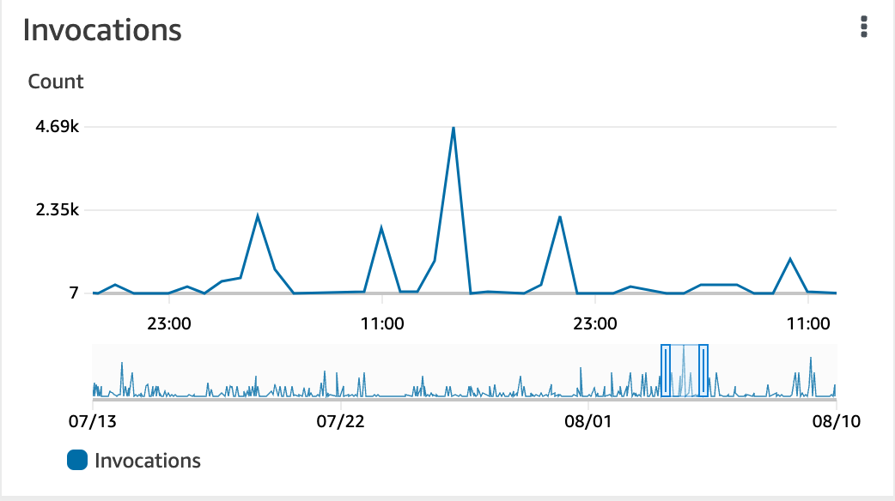
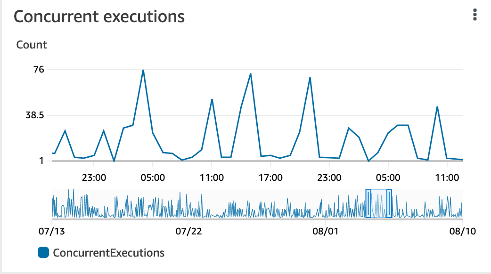
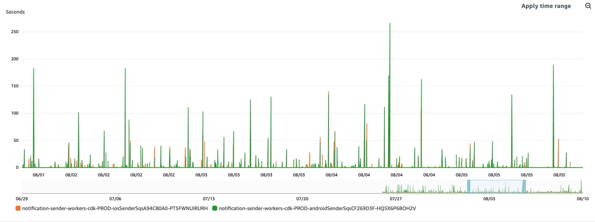
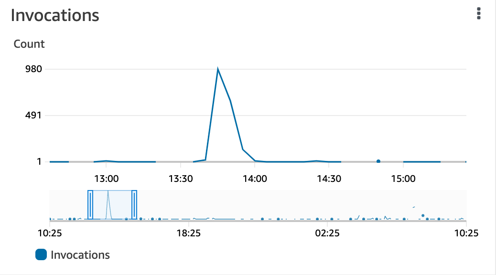
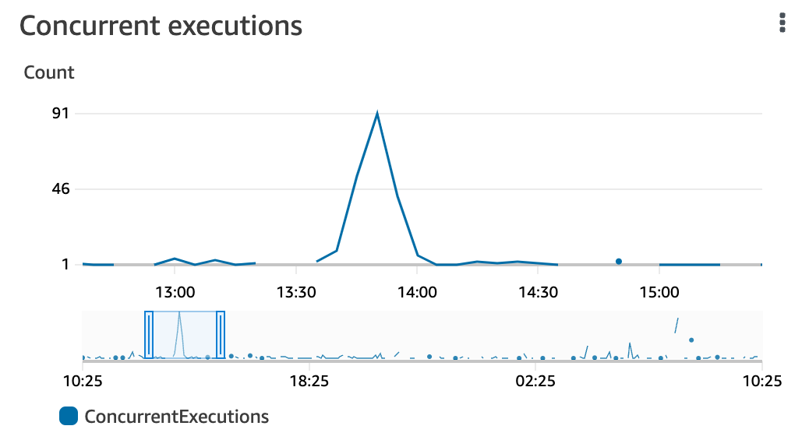
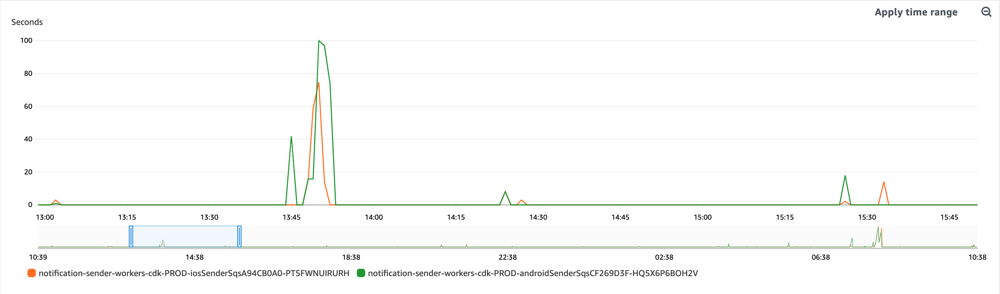
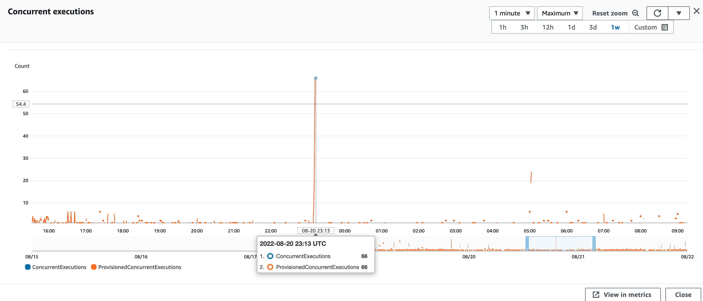

# Provisioned Concurrency

We [know](07-lambda-timing.md) the sender lambdas are a bottleneck in achieving our 90in2 target. The sender lambdas have an SQS pull event source, meaing the lambda functions are invoked when messages arrive on a queue.

We raised a support case with AWS to understand how to improve the concurrency of these lambdas and they suggested the use of [provisioned concurrency](https://aws.amazon.com/blogs/aws/new-provisioned-concurrency-for-lambda-functions/), which we have tested over a number of days. We measured some key metrics to understand if any improvements were made:
- The '90% in 2' statistics for breaking news notifications
- The number of concurrent executions of our lambdas
- The approximate age of messages on the associated queues (i.e. the time taken before messages were processed by the lambdas)

The results didn't show a consistent positive improvement, especially when multiple notifications were being sent at the same time (the scenario when we most need improved concurrency).

Given we didn't see the improvements in metrics that we expected we again contacted AWS. They suggested to try configuring different settings:
- Increasing the batch size (i.e. the number of messages each lambda can stream from a queue).
- Reviewing the metric `ApproximateNumberOfMessagesVisible` as part of our assessment and understanding of the situation.
- Increasing the queue's visibility timeout.

The recommendation for next steps is to follow the guidance provided by AWS. If we begin to see lambda scaling increasing further as a result then it may be worth revisiting provisioned concurrency again.

Another recommendation is to advise editorial to wait 2 minutes between sending multiple alerts: we see significant improvement in delivery times if we delay 2 mins between sending notifications (compare the results of Serena Williams vs Olesksandr Usyk).


## No provisioned concurrency

There was some metrics about our existing architecture/configuration that led us to hypothesise that we had a concurrency issue with the ios and android sender lambdas:

1. Invocation count vs concurrent executions

Our sender lambdas include metrics about the invocation count (how many times the lambda function is being executed) and the number of concurrent executions (how many lambda execution environments are running in parallel).




Given we define a reserved concurrency (i.e. the maximum number of lambda execution environments available at a given time) of 250, the number running in parallel is significantly less than our maximum. Running more execution environments concurrently should increase our throughput (reduce time taken to send notifications).

2. Time that messages spend on the queue

Our sender lambdas are triggered by an SQS queue. When messages land on this queue the sender lambdas will be invoked and will process these messages.

A metric to consider is the time that messages spend on the queue before being processed. We could see large times, meaning there were significant delays before lambdas were processing these messages. Having more lambdas available to process messages should reduce this time and increase our 90in2 percentage.



Before changing the provisioned concurrency we collected some notification send statistics:

| notificationId                       | topic                  | total sent | within 2mins | 90 in 2 % | time sent   | total duration (ms) | title                                                                                                          |
|:-------------------------------------|:-----------------------|:-----------|:-------------|:----------|:------------|:--------------------|:---------------------------------------------------------------------------------------------------------------|
| d5f957c4-90d5-4b87-b4a8-d179725d01e5 | breaking/uk            | 896,948    | 564,619      | 63        | 09/08 08:55 | 154,317             | UK energy bills now forecast to hit £4,266 from January                                                        |
| 05b5c029-19f6-4789-aa9f-66e605c43cc8 | breaking/uk            | 889,480    | 525,795      | 59        | 09/08 09:09 | 257,965             | Issey Miyake, famed Japanese fashion designer, dies aged 84                                                    |
| cc92fd7d-0feb-4aaf-ba71-f4f0cb49b9b1 | breaking/international | 554,348    | 151,097      | 27        | 09/08 09:10 | 247,130             | Issey Miyake, famed Japanese fashion designer, dies aged 84                                                    |
| 87c19f4c-0bf7-4ddd-86b3-4acf21ba6019 | breaking/uk            | 889,414    | 496,859      | 56        | 09/08 09:32 | 249,708             | Lamont Dozier, Motown songwriter famed for hits including Baby Love and Stop in the Name of Love, dies aged 81 |
| 3c6897ea-a903-435f-b5b2-7cf9c3620900 | breaking/international | 554,562    | 181,101      | 33        | 09/08 09:33 | 260,431             | Lamont Dozier, Motown songwriter famed for hits including Baby Love and Stop in the Name of Love, dies aged 81 |
| adc6d742-4b3c-4d84-bef8-a297eda64247 | breaking/us            | 287,288    | 156,950      | 55        | 09/08 09:33 | 240,422             | Lamont Dozier, Motown songwriter famed for hits including Baby Love and Stop in the Name of Love, dies aged 81 |
| 306a0857-5bbb-424d-8dc2-df621c44326b | breaking/uk            | 883,327    | 573,251      | 65        | 09/08 10:01 | 173,542             | sport/2022/aug/09/toni-minichiello-banned-for-life-by-uk-athletics-over-sexually-inappropriate-conduct         |

## Provisioned concurrency (100 each for both the ios and android sender lambdas)

We manually configured our sender lambdas:
- defined a [version](https://docs.aws.amazon.com/lambda/latest/dg/configuration-versions.html) for each of our lambdas.
- configured the provisioned concurrency for the version, which was set to 100 for this test.
- set the SQS trigger for the versioned lambda and removed the trigger from our $LATEST lambda.

NB: provisioned concurrency can only be defined for a version or alias of a lambda function.

We collected notification send statistics during the testing period:

| notificationId                       | topic                  | total sent | within 2mins | 90 in 2 % | time sent   | total duration (ms) | title                                                                         |
|:-------------------------------------|:-----------------------|:-----------|:-------------|:----------|:------------|:--------------------|:------------------------------------------------------------------------------|
| e65654b0-f0dd-4fb2-bd75-463e4bd0068f | breaking/uk            | 886,121    | 770,400      | 87        | 09/08 13:47 | 141,705             | Serena Williams announces she will retire from tennis after glittering career |
| 1b730aab-308f-419b-b2ac-7920c997bfdb | breaking/us            | 292,628    | 277,288      | 95        | 09/08 13:49 | 125,882             | Serena Williams announces she will retire from tennis after glittering career |
| 155669af-127c-4a1a-9210-50c455c6a24b | breaking/international | 560,515    | 523,142      | 93        | 09/08 13:50 | 130,877             | Serena Williams announces she will retire from tennis after glittering career |
| 9c0e3710-3660-4279-b6a8-7c4a963e11de | breaking/au            | 170,519    | 166,630      | 98        | 09/08 13:55 | 34,273              | Serena Williams announces she will retire from tennis after glittering career |

The 90in2 percentage was significantly increased. The metrics confirm that we had improved the key metrics we'd identified:





However, when we received multiple notifications in quick succession we didn't see such positive improvements:

| notificationId                       | topics                                  | total sent | within 2mins | 90 in 2 % | time sent   | total duration (ms) | title                                                                          |
|:-------------------------------------|:----------------------------------------|:-----------|:-------------|:----------|:------------|:--------------------|:-------------------------------------------------------------------------------|
| 79542376-ed97-3d75-9023-2904f2c0ed02 | liveblog update                         | 152        | 149          | 98        | 20/08 23:09 | 1,841               | Olesksandr Usyk beats Anthony Johusa to retain world heavyweight boxing titles |
| 97a8c6a9-ea3e-45b7-ad43-0fd722ff8253 | breaking/international                  | 507,548    | 80,761       | 55        | 20/08 23:10 | 195,698             | Olesksandr Usyk beats Anthony Johusa to retain world heavyweight boxing titles |
| 20fa9f7c-2e98-429d-8475-1af6f1c6dfb5 | breaking/uk                             | 853,832    | 762,137      | 89        | 20/08 23:10 | 132,682             | Olesksandr Usyk beats Anthony Johusa to retain world heavyweight boxing titles |
| 161d9df8-540f-40bf-ad7e-b8bb286f14a7 | sport/uk, sport/us, sport/international | 17,358     | 6,463        | 37        | 20/08 23:10 | 147,521             | Olesksandr Usyk beats Anthony Johusa to retain world heavyweight boxing titles |

We could also see that provisioned concurrency had not increased as we expected:



## Conclusion

After our testing did not produce the results we expected we contacted AWS for advice. This is their full response:

```markdown
I understand that you set provisioned concurrency for your Lambda function “mobile-notifications-workers-android-sender-ctr-PROD” which has an SQS Pull Event source and would like to know why its not scaling optimally and want reduced time that a message spends waiting in the queue before processing.

To begin, allow me to explain that in a standard queue, Lambda will start long polling with 5 concurrent executions. If there are messages in the queue, the scaling increases by 60/min until reserved concurrency or account concurrency is reached. However, Lambda will not scale if there are errors or throttles. Having said this, during the given time period of 20th August at 23.10 UTC, I saw Lambda returned an error that might have prevented scaling. Though one error shouldn’t be an issue, If during that time the error happened when you had a lot of messages in the queue, then it could have prevented scaling at that time. Polling can continue until the batch window set time is reached, or the 10000 batch size reached or 6MB payload size is reached. If the average age of oldest message metric increases then you should consider increasing batch size and batch window-which is the amount of time taken to gather records. Having said this, I see your batch size is set to 1 which I believe needs to be increased.

Also, its of vital importance to note that Lambda will scale invocations only if there are messages in the queue. If there are no messages to be polled the inflight messages will be less and the lambda will not scale up because Lambda will be successfully processing messages in the queue. Review your ApproximateNumberOfMessagesVisible metric. If the metric is low or at 0, your function can't scale. If the metric is high and there are no invocation errors, try increasing the batch size on your event notification. Increase the batch size until the duration metric increases faster than the batch size metric.

Additionally, to allow your function time to process each batch of records, set the source queue's visibility timeout to at least six times the timeout that you configure on your function. In your case, the visibility time should be set to 540 seconds. Kindly refer to documentation on links [1][2] for more details.

References:
[1] https://docs.aws.amazon.com/lambda/latest/dg/with-sqs.html#events-sqs-queueconfig
[2] https://aws.amazon.com/premiumsupport/knowledge-center/lambda-sqs-scaling/

```

We should implement their suggestions before testing with provisioned concurrency again. Note the limitation on lambda scaling: 60/min. This could indicate that we can't scale up as quickly as we need during our peaks in traffic, but this will be validated during further experimentation and tests.