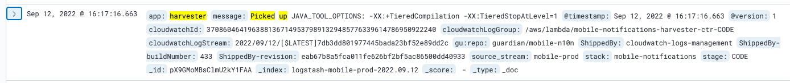
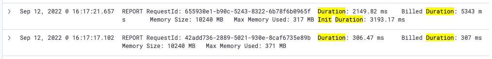

# Background

We are exploring ways to improve the performance of lambda functions.  One of the [suggestions](https://github.com/guardian/mobile-n10n/pull/693#issuecomment-1199145883) is to restrict the tiered compilation to level 1 to cut down the cold start duration.

Internally the JVM has two just-in-time compilers known as C1 and C2.  The C1 compiler aims at shorter response time while the C2 compiler is used to achieve higher performance after profiling.  By default, JVM use both C1 and C2 compilations in combination.  It starts executing Java bytecode with C1 in the beginning and in the meantime performs profiling to decide which section of code to recompile with C2 which use more aggressive (and more time-consuming) optimization.

The AWS articles, [here](https://aws.amazon.com/blogs/compute/increasing-performance-of-java-aws-lambda-functions-using-tiered-compilation/) and [here](https://aws.amazon.com/blogs/compute/optimizing-aws-lambda-function-performance-for-java), suggest that short-running lambda functions may give a better performance if we restricts the tiered compilation to 1, where the JVM skips the profiling work and sticks to C1 compiler.  It is believed that the C2 compilation is less likely to be useful if the function has a short executation duration, and skipping the profiling working may cut down the cold start time with little risk of reducing warm start performance.

# Set up

Based on this [AWS article](https://aws.amazon.com/blogs/compute/optimizing-aws-lambda-function-performance-for-java/), we are able to set the JVM option of restricting tiered compilation via an environment variable.  Even though we use docker image to package the lambda functions, the lambda functions picked up the new settings from the environment variable:

We tested the performance by sending one breaking news notifications to the topics `breaking/uk`, `breaking/us`, `breaking/au` and `breaking/international`, which had a total of 3,358,659 recipients.  We ran three rounds of test with and without restricted tiered compilation each.

# Test Result

We ran the test on `CODE` and so the sender lambda functions were actually executed with `dry-running` mode (i.e. without calling Apple/Google API).

We have the following figures for default JVM options:

| # | No. harvester invocations | Avg. harvester processing (s) | Total harvester duration (s) | No. sender invocations | Avg. sender processing (s) | Total sender duration (s) |
| ----------- | ----------- | ----------- | ----------- | ----------- | ----------- | ----------- |
| 1	| 335 | 26.59 | 40.45 | 3678 | 30.35 | 69.79 |
| 2	| 335 | 24.93 | 36.56 | 3678 | 35.12 | 72.29 |
| 3	| 335 | 21.40 | 32.94 | 3678 | 38.67 | 76.03 |
| AVG | 335 | 24.30 | 36.65 | 3678 | 34.71 | 72.70 |

And for tiered compilation level restricted to 1:

| # | No. harvester invocations | Avg. harvester processing (s) | Total harvester duration (s) | No. sender invocations | Avg. sender processing (s) | Total sender duration (s) |
| ----------- | ----------- | ----------- | ----------- | ----------- | ----------- | ----------- |
| 1	| 335 | 24.77 | 37.59 | 3678 | 28.75 | 71.99 |
| 2	| 335 | 18.30 | 28.82 | 3678 | 38.84 | 78.26 |
| 3	| 335 | 18.45 | 27.38 | 3678 | 29.38 | 74.50 |
| AVG | 335 | 20.50 | 31.26 | 3678 | 32.32 | 74.92 |

With the new setting, the average harvester processing time was reduced by 14.7% but the average sender processing time was increased slightly by 3%.

Since the JVM settings affects the duration of cold start as well as the duration of warm start execution, I collected the duration of the lambda execution from the logs written by AWS:

Logs with `Init Duration` indicates a lambda invocation with cold start.  The `Init Duration` is the time spent on the initialisation which happens during cold start.  The `Duration` is the execution duration of the application code in a lambda function.

I computed the average cold start initialization based on the duration in the `Init Duration` field.   I used the `Duration` field of the lambda invocation without cold start to calcuate the average warm start execution time.  The results are as follows:

For default JVM Options:

| # | Average cold start initialization - harvester (ms) | Warm start harvester execution (ms) | Average cold start initialization - sender (ms) | Warm start sender execution (ms) |
| ----------- | ----------- | ----------- | ----------- | ----------- |
| 1 | 4536.59 | 282.04 | 4801.90 | 260.18 |
| 2 | 4295.87 | 276.22 | 4421.57 | 255.40 |
| 3 | 4097.97 | 248.73 | 4418.15 | 256.26 |
| AVG | 4310.14 | 269.00 | 4547.21 | 257.28 |

For tiered compilation level restricted to 1:

| # | Average cold start initialization - harvester (ms) | Warm start harvester execution (ms) | Average cold start initialization - sender (ms) | Warm start sender execution (ms) |
| ----------- | ----------- | ----------- | ----------- | ----------- |
| 1 | 3599.89 | 302.88 | 3716.05 | 391.90 |
| 2 | 3127.66 | 307.56 | 3457.15 | 374.05 |
| 3 | 3272.92 | 277.40 | 3462.68 | 393.29 |
| AVG | 3333.49 | 295.95 | 3545.30 | 386.41 | 

# Conclusion

1. From the test results on the overall duration, it seems to suggest that there may be a small improvement (around 15%) on the harvester lambda but no (if not worse) improvement on the sender lambda.

2. The impact of the restricted tiered compilation is more noticeable on the initialization / warm start execution of lambda.  
- For harvester, the average cold start initialization duration was reduced by around 22% but the warm start execution time was increased by 10%.
- For sender, the average cold start initialization duration was reduced by around 22% but the warm start execution time was increased by 50%.

3. The impact we noticed seems to be reasonable.  Restricting tiered compilation to 1 is expected to cut down the cold start initialization time but it may increase the warm-start execution if it executes the same piece of code repeatedly for quite a while.

4. Based on the results, it seems likely that this setting can help with the performance of harvesters but not the sender worker.

