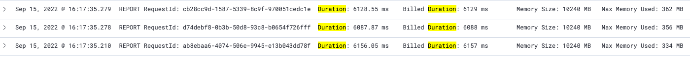
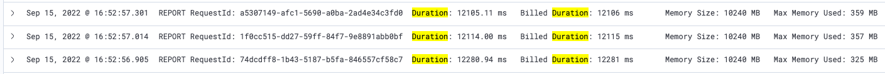

# Background

Currently each worker lambda is responsible for processing 1000 tokens. We are exploring if we get efficiency gains by increasing that number.

# Set up

The harvester was modified to write a maximum of 2,000 tokens (instead of 1,000) in a SQS record fof sender workers.  As a result, sender workers process around 2,000 tokens by each invocation.  The number of thread is set to 50.

We ran the test on `CODE` and so the sender lambda functions were actually executed with `dry-running` mode.  We added a Thread.sleep(300) to simulate the delay we would expect to see if we called Apple/Google API, as in [this test](08-thread-pool-size.md).

# Test Result

We have the following results for 1000 tokens:

| # | No. harvester invocations | Avg. harvester processing (s) | Total harvester duration (s) | No. sender invocations | Avg. sender processing (s) | Total sender duration (s) |
| ----------- | ----------- | ----------- | ----------- | ----------- | ----------- | ----------- |
| 1	| 335 | 19.47 | 28.39 | 3695 | 148.80 | 253.07 |
| 2	| 335 | 19.38 | 27.04 | 3678 | 138.98 | 240.85 |
| 3	| 335 | 17.02 | 24.47 | 3678 | 139.20 | 236.76 |
| AVG | 335 | 18.62 | 26.63 | 3683.67 | 142.33 | 243.56 |

We have the following results for 2000 tokens:

| # | No. harvester invocations | Avg. harvester processing (s) | Total harvester duration (s) | No. sender invocations | Avg. sender processing (s) | Total sender duration (s) |
| ----------- | ----------- | ----------- | ----------- | ----------- | ----------- | ----------- |
| 1	| 335 | 18.84 | 29.36 | 2009 | 146.99 | 247.06 |
| 2	| 335 | 21.40 | 29.19 | 2006 | 136.86 | 233.85 |
| 3	| 335 | 20.03 | 27.25 | 2006 | 142.36 | 250.39 |
| AVG | 335 | 20.09 | 28.60 | 2007 | 142.07 | 243.77 |

Based on the test results, it does not seem to make any consistent improvement when we make the sender worker to process 2,000 tokens in one invocation despite the fact that the total number of invcations of sender is reduced nearly by half.

We look at the duration of some individual invocations.  The sender lambda takes around 6 seconds to process 1000 tokens:

And it takes around 12 seconds to process 2000 tokens.

Internally the sender worker uses multithreading model to processes tokens in a concurrent manner.  It does not help in this case because the size of thread pool, which is 50 on CODE (100 on PROD), is far below the number of tokens.

# Conclusion

Under the current architecture, it appears that we cannot improve the performance of the notification delivery by making sender workers process more tokens in one invocation.

