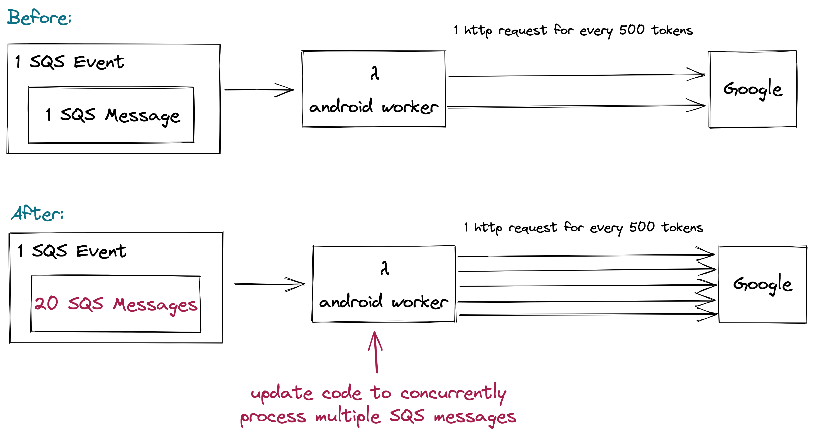
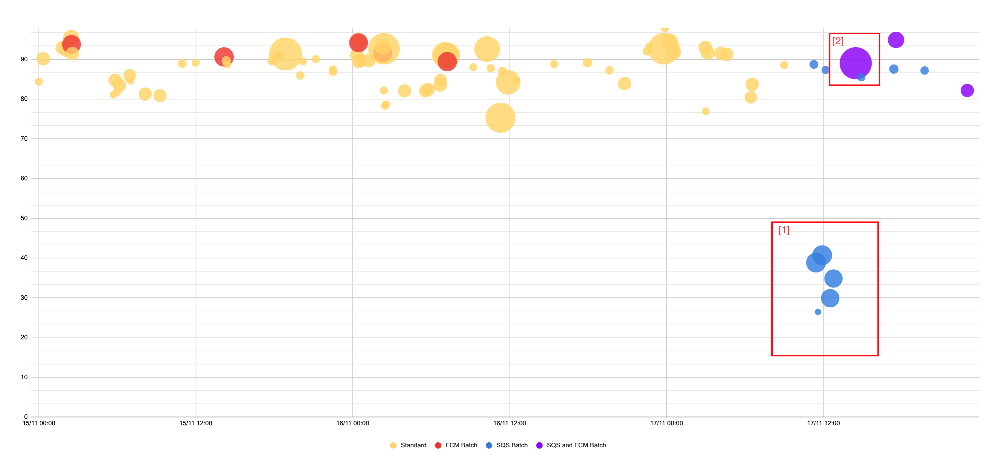

# Background

We recently tested the results of batching:
- Grouping tokens when making http requests to firebase
- Processing multiple SQS messages per lambda invocation

This document explains the results of the experimentation and some suggested next steps.

## Grouping tokens when making http requests to firebase

We want to increase the function processing rate of our worker lambdas because they are the bottleneck for achieving our 90in2 SLO. We tried [testing](https://github.com/guardian/mobile-n10n/pull/747) the impact of multicast message sending our tokens to firebase. 

This illustrates the configuration of our experiment:

We observed the following results:

- the latency of a multicast message request was higher than the latency of a request to send an individual token (2600ms vs 70ms, respectively)
- the latency for sending 500 tokens is only ~38 times greater than sending for an individual token, so there is a potential efficiency gain by sending in batches, however:
- tokens were sent in groups of 500, meaning each lambda invocation would make, at most, only 2 http requests in parallel
- given the parallelism we already achieve, the overall result meant that making many shorter requests concurrently was quicker than making fewer longer requests (verified because the average lambda duration is typically smaller than the latency of a single average multicast message request).
 
NB: thinking about the parallelism we already achieve when sending individual notifications, we could estimate this as:

( average latency of a request * average number of requests made) / average total duration of lambda execution

( 70 ms * 1000 ) / 2400 ms

~29

We considered some options to increase the number of parallel batch notification http requests:

1. increase the number of tokens each sqs event contains: we cannot significantly increase the number of tokens in each single sqs message due to the sqs message limit (256kb, but we already send about 140kb of data)
2. increase the batch size (the number of messages each lambda invocation processes): this is a good option but when testing we could see a linear relationship between duration and batch size, indicating that batches of sqs messages were being processed sequentially, not concurrently.

We decided to test option 2

## Processing multiple SQS messages per lambda invocation

We changed some [code](https://github.com/guardian/mobile-n10n/pull/823) to allow our lambda functions to concurrently process batches of SQS messages.

The experiment configuration can be illustrated by the following:

We pushed this change and evaluated the results. 

### 90in2 Metric

Below is a graph to try to explain what happened the during the first day of the experiment.

The x-axis is time, the y-axis is the 90in2 metric, the bubbles correspond to specific notifications we've sent, the data is considering the android platform _only_. The diameter of the bubble correlates to the number of readers receiving the notification (bigger bubble = more people receiving the notification).

Before allowing lambdas to process 20 SQS messages per invocation, we'd also been allowing certain topics to send in groups to firebase (the red bubbles), this didn't seem to degrade our 90in2 SLO too much, but the overall number of recipients receiving notifications via this method were relatively small (<550k) owing to the fact that we'd limited what topics were allowed to send tokens in groups.

At ~9.30am of the day of the day of the experiment I pushed a change to allow _all_ worker lambdas to concurrently process 20 messages from sqs per invocation. The result of this change are the blue bubbles. Considering the group labelled [1] there was a significant degradation. The degradation occurred when processing 20 sqs messages per invocation, but when still sending each token via a single http request (the same kind of degradation was also seen for iOS).

The likely reason for the degradation in performance of the blue bubbles is that, when sending a single token per http request we already operated at close to our maximum concurrency, so asking each invocation to process 20x the number of tokens meant that we ran out of threads, couldn't process as many things as we needed to in parallel, which increased the time to complete sending.

At 2pm yesterday I extended the topics allowed to send tokens in groups to firebase. I included all breaking topics in the allowed list. The purple bubbles represent a combination of batching: both processing 20 sqs message per invocation and sending groups of tokens to firebase per http request.

The purple bubbles resolved the degradation we'd seen earlier in the day: each lambda invocation was making fewer http requests so we had threads available to process (at max) the 20 sqs messages we were receiving. The biggest performance improvement was seen when making requests to very highly subscribed topics. a lesser improvement was seen when sending notifications to lower subscribed topics.

For highly subscribed topics we currently have only a single data point: a breaking news notification that was sent to all 4 regions, meaning android processed ~760k tokens. We achieved a 90in2 for android-only of 89% (90in3 of 91%). Over the past 10 days, comparable notifications sent before the experiment were delivered with an android-only 90in2 ranging from 75-93%

### Function Processing Rate

Considering all notifications sent to >1.8M readers from the past two weeks we can make some comparisons:

| Date time   | Notification id                      | avg  chunkTokenSize | avg functionProcessingTime (ms) | avg Processing Rate (tokens/s) | total duration (s) | 90in2 |
|-------------|--------------------------------------|---------------------|---------------------------------|--------------------------------|--------------------|-------|
| 08/11 23:00 | bf87ee0d-d4c7-40ac-b235-8408cc4a4aaa | 867                 | 1,390                           | 1,195                          | 194.36             | 94    |
| 09/11 07:09 | 56aa2ace-4a66-4a4f-be2f-336041c764ce | 834                 | 1,583                           | 924                            | 163.63             | 91    |
| 09/11 11:40 | cee9f9c0-2e1f-4b7d-883b-a4e024525f3e | 844                 | 1,294                           | 734                            | 113.59             | 93    |
| 09/11 15:30 | f5265917-4184-4783-af94-131a34610ea2 | 849                 | 1,598                           | 702                            | 192.16             | 89    |
| 15/11 18:52 | ea22645b-2a15-4012-a82c-b0788b201b01 | 823                 | 1,804                           | 774                            | 193.98             | 94    |
| 16/11 11:18 | 4d9ad720-ac0b-4432-ae65-1e2c5ec257e1 | 832                 | 2,082                           | 554                            | 170.65             | 89    |
| 17/11 14:28 | 519deb6f-6082-4540-8c79-f8def4959998 | 836                 | 7,406                           | 975                            | 90.56              | 90    |

Only the final data point was sent using SQS batching and grouping tokens being sent to firebase. Perhaps a single data point isn't sufficient:
- We can see quite a lot of variability in the function processing rate, we should collect more data.
- The average processing time is 3-4 times greater with batched SQS messages and grouped tokens. In this configuration each lambda processes an average of 14 SQS messages, so there is still an efficiency gain.
- The total time is significantly lower when sending with batched SQS messages and grouped tokens. Even though we completed sending in 90s, our 90in2 stat was only 89%.

### Errors

### Other AWS Metrics

## 90in2 By Platform

Looking at the 90in2 by platform, actually we can see a huge difference between iOS and android:

Android already achieves a higher 90in2, but it delivers ~200k fewer tokens.

## Recommendations

Retain the current android-only experiment to process 20 SQS messages per invocation and send groups of tokens to Firebase. We should monitor whether this achieves a consistently high 90in2 metric.

Explore the option of sending iOS notifications via Firebase instead of APNS.

Explore whether there are any iOS/APNS optimisations we can make.