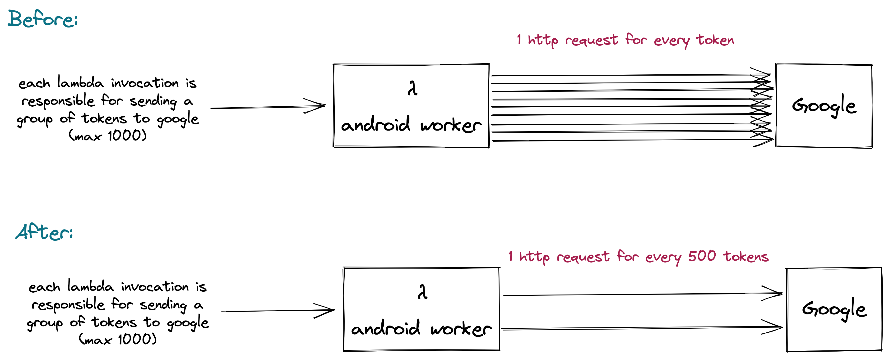
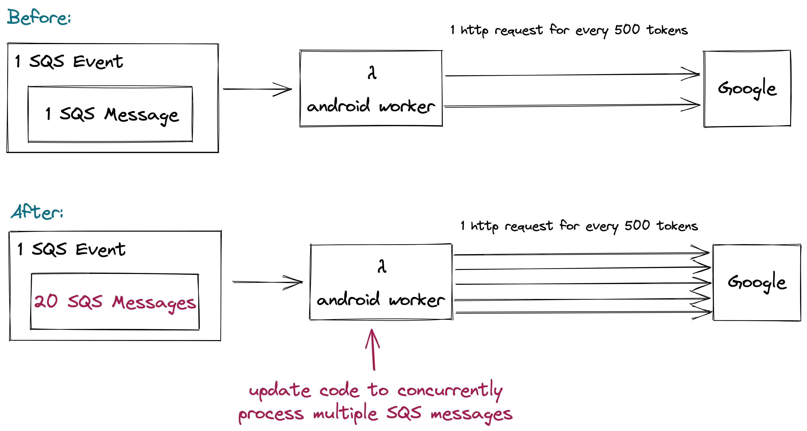
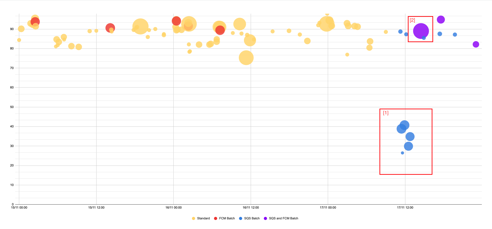
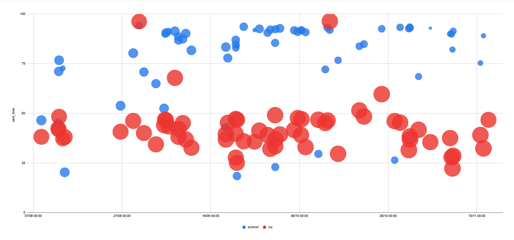

# Background

We recently tested the results of batching:
- Grouping tokens when making http requests to firebase
- Processing multiple SQS messages per lambda invocation

The suggested follow-on actions are:
- retain the current configuration we have in the android worker for sending notifications to firebase, but continue to monitor performance for large notification sends
- capture a correlating metric, to use alongside the 90in2 metric, to help when assessing the performance of our stack
- explore potential improvements to the code of the iOS sender worker
- research how firebase send messages to iOS devices

This document explains the results of the experimentation and the rationale for the suggested next steps.

## Grouping tokens when making http requests to firebase

We want to increase the function processing rate of our worker lambdas because they are the bottleneck for achieving our 90in2 SLO. 
We tried [testing](https://github.com/guardian/mobile-n10n/pull/747) the impact of using multicast messaging to send our tokens to firebase. 

This illustrates the configuration of our experiment:

We observed the following results:

- the latency of a multicast message request was higher than the latency of a request to send an individual token (2600ms vs 70ms, respectively)
- the latency for sending 500 tokens is only ~38 times greater than sending for an individual token, so there is a potential efficiency gain by sending in batches, however:
- tokens were sent in groups of 500, meaning each lambda invocation would make, at most, only 2 http requests in parallel
- given the parallelism we already achieve, the overall result meant that making many shorter requests concurrently was quicker than making fewer longer requests (verified because the average lambda duration is typically smaller than the latency of a single average multicast message request).
 
NB: thinking about the parallelism we already achieve when sending individual notifications, we could estimate this as:

( average latency of a request * average number of requests made) / average total duration of lambda execution

( 70 ms * 1000 ) / 2400 ms

~29

We considered some options to increase the number of parallel multicast http requests:

1. increase the number of tokens each SQS event contains: we cannot significantly increase the number of tokens in each single SQS message due to the SQS message limit (256kb, but we already send about 140kb of data)
2. increase the batch size (the number of messages each lambda invocation processes): this is a good option but when testing we could see a linear relationship between duration and batch size, indicating that batches of SQS messages were being processed sequentially, not concurrently.

We decided to test option 2.

## Processing multiple SQS messages per lambda invocation

We changed some [code](https://github.com/guardian/mobile-n10n/pull/823) to allow our lambda functions to concurrently process batches of SQS messages.

The experiment configuration can be illustrated by the following:

We pushed this change and evaluated the results. 

### 90in2 Metric

Below is a graph illustrating what happened the during the first days of the experiment.

The x-axis is time, the y-axis is the 90in2 metric, the bubbles correspond to specific notifications we've sent, the data is considering the android platform _only_.
The diameter of the bubble correlates to the number of readers receiving the notification (bigger bubble = more people receiving the notification).
Ideally we want all bubbles as high as possible.

Before allowing lambdas to process 20 SQS messages per invocation, we'd also been allowing certain topics to use multicast messaging (the red bubbles),
this didn't seem to degrade our 90in2 SLO too much, but the overall number of recipients receiving notifications via this method were relatively small (<550k)
owing to the fact that we'd limited what topics were allowed to send tokens in groups.

At ~9.30am of the day of the experiment I pushed a change to allow _all_ worker lambdas to concurrently process 20 messages from SQS per invocation.
The result of this change are the blue bubbles. Considering the group labelled [1] there was a significant degradation.
The degradation occurred when processing 20 SQS messages per invocation, but when continuing to send each token via a single http request (the same kind of degradation was also seen for iOS).

The likely reason for the degradation in performance of the blue bubbles is that, when sending a single token per http request, each lambda invocation was already operating at close to its maximum concurrency.
Asking each invocation to process 20x the number of tokens meant that we ran out of threads, couldn't process as many things as we needed to in parallel, which increased the time to complete sending.
This theory was [corroborated](https://github.com/guardian/mobile-n10n/pull/837) by out of memory errors thrown by certain invocations, where more threads were attempted to be spun up than possible.

At 2pm the following day I extended the topics allowed to send tokens in groups to firebase.
I included all breaking topics in the allowed list.
The purple bubbles represent a combination of batching: both processing 20 SQS message per invocation and sending groups of tokens to firebase per http request.

The purple bubbles resolved the degradation we'd seen on day 1 of th experiment: each lambda invocation was making fewer http requests,
so we had threads available to process (at max) the 20 SQS messages we were receiving.
The biggest performance improvement was seen when making requests to very highly subscribed topics, a lesser improvement was seen when sending notifications to lower subscribed topics.

### Function Processing Rate

Below are all notifications sent to >1.8M readers since the experiment began:

| Date time   | Notification id                      | avg  chunkTokenSize | avg functionProcessingTime (ms) | avg Processing Rate (tokens/s) | total duration (s) | 90in2 |
|-------------|--------------------------------------|---------------------|---------------------------------|--------------------------------|--------------------|-------|
| 08/11 23:00 | bf87ee0d-d4c7-40ac-b235-8408cc4a4aaa | 867                 | 1,390                           | 1,195                          | 194.36             | 94    |
| 09/11 07:09 | 56aa2ace-4a66-4a4f-be2f-336041c764ce | 834                 | 1,583                           | 924                            | 163.63             | 91    |
| 09/11 11:40 | cee9f9c0-2e1f-4b7d-883b-a4e024525f3e | 844                 | 1,294                           | 734                            | 113.59             | 93    |
| 09/11 15:30 | f5265917-4184-4783-af94-131a34610ea2 | 849                 | 1,598                           | 702                            | 192.16             | 89    |
| 15/11 18:52 | ea22645b-2a15-4012-a82c-b0788b201b01 | 823                 | 1,804                           | 774                            | 193.98             | 94    |
| 16/11 11:18 | 4d9ad720-ac0b-4432-ae65-1e2c5ec257e1 | 832                 | 2,082                           | 554                            | 170.65             | 89    |
| 17/11 14:28 | 519deb6f-6082-4540-8c79-f8def4959998 | 836                 | 7,406                           | 975                            | 90.56              | 90    |
| 20/11 01:30 | b988ad53-5a28-4a40-807c-fd178c2368e0 | 833                 | 5,285                           | 8,690                          | 81.41              | 94    |
| 21/11 10:38 | bdad129d-bf5e-42d0-83c7-94ca19f563af | 843                 | 5,823                           | 10,538                         | 72.52              | 92    |
| 21/11 16:25 | 63d4ab9c-d530-4dd3-b64b-b99c2eda9633 | 837                 | 5,498                           | 6,427                          | 120.37             | 94    |
| 28/11 11:01 | 6744f544-524a-4fc8-8504-57b888e28b2e | 838                 | 6,474                           | 6,736                          | 113.24             | 92    |
| 28/11 13:03 | 3fad2938-2605-4711-b4af-c904eb46bbf4 | 838                 | 5,421                           | 5,973                          | 127.08             | 92    |

08/11 - 16/11: using multicast messaging to send to firebase, but processing only 1 SQS message per invocation

17/11 - 21/11: using multicast messaging to send to firebase, and processing max 20 SQS messages per invocation

22/11 - 28/11: using multicast messaging to send to firebase, and processing max 10 SQS messages per invocation

29/11 onwards: using multicast messaging to send to firebase, and processing max 20 SQS messages per invocation

NB: we temporarily reduced the max SQS messages per invocation because of the volume of errors we received from firebase.
We understand the [cause](#errors) for these errors better after the investigation and have since (29/11 onwards) increased the max SQS messages per invocation back to 20.

There aren't a huge number of data points, but from what we've collected:
- We see better function processing rates and shorter total durations when using both multicast messaging and processing more than 1 SQS message per invocation.
- We see the best function processing rate when processing a maximum of 20 SQS messages per invocation.
- Even though the total duration is significantly lower when sending with batched SQS messages and grouped tokens, the 90in2 metric is not significantly higher.

The 90in2 metric includes part of the flow that is entirely outside our control: how quickly firebase send our messages to real devices, and environmental factors like whether a device is offline.
We may want to correlate our 90in2 SLO with another metric, that is more within our control, to reason about whether our system is performing well or not.

### Errors

One of the reasons the experiment was extended was because we saw a large increase in the number of errors from firebase.
We saw an increase in the following types of errors:
- socket time out
- server [unavailable](https://firebase.google.com/docs/reference/admin/error-handling#:~:text=same%20Firebase%20project.-,UNAVAILABLE,-Cloud%20Messaging%20service)

We contacted firebase admin support and they indicated that:
- Firebase is a free service, and there is no premium tier available.
- Firebase have an anti-abuse rate limiting feature.
- Firebase therefore have a limit on how many messages you can send per second.
- The errors we were seeing are a likely indicator that we were being throttled by firebase.

The increase in errors was initially confusing but the response from firebase helps this make sense:
looking at the typical function processing rates we were achieving, we can sometimes send ~10,000 tokens per second.
This correlates to the theoretical maximum throughput you can achieve using [topic messaging](https://firebase.google.com/docs/cloud-messaging/concept-options#topics_throttling) too, so feels like a reasonable explanation for being throttled.

## 90in2 By Platform

Looking at the 90in2 by platform, we can see a huge difference between iOS and android:

Android already achieves a higher 90in2, but it delivers ~200k fewer tokens. 
Improving our overall 90in2 metric will rely on improving the speed at which we can send notifications to iOS devices.

## Recommendations

During this experiment we could see the value in using more than just the 90in2 metric to evaluate any improvement.
It's suggested that we correlate our 90in2 metric with another one in order to better understand the performance of our stack. 
The correlating metric could be the function processing rate a new one: aggregated lambda duration
(i.e. for each notification, the time from when the first lambda begins processing the first message to when the last lambda finishes processing the last message).

We should retain the current configuration of the android worker (processing 20 SQS messages per invocation and sending using multicast messaging).
Because we don't have a huge number of data points (particularly for large notifications) we should continue to monitor whether the configuration achieves a consistently high 90in2 metric.

We did some research to understand how [topic messaging](15-topic-messaging.md) could work. This would require a significant change to our infrastructure, but would also simplify it (and reduce infrastructure costs).
We may want to consider how this could work for both platforms (iOS and android) before committing to this approach.
We should explore the option of sending iOS notifications via Firebase instead of APNS (specifically to understand if Firebase proxy via APNS to deliver messages directly to devices).

Given there have been opportunities to improve the concurrency within the android worker, it would be good to explore if similar opportunities exist within the iOS sender worker.
We can see that the 90in2 metric is skewed by messages being sent to iOS devices, so improving their performance should yield the next biggest impact on the 90in2 metric.