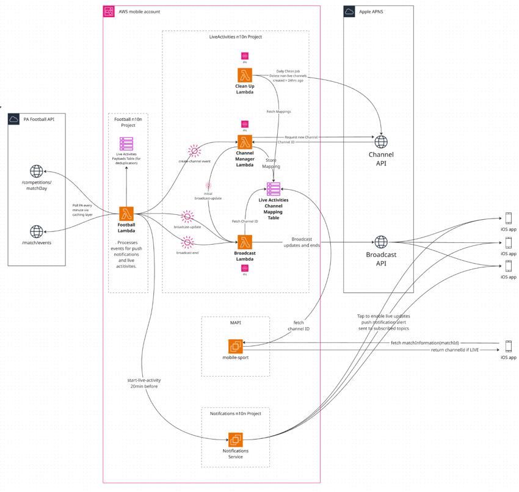

# Live Activities

Live Activities is an iOS feature that provides a richer notification experience using Apple's APNS Live Activity API. It offers an enhanced UI, reduces individual notification alerts, and delegates device delivery to Apple — we send a single payload to Apple, which broadcasts it to all subscribed iOS devices.

Currently live in Production for Football notifications only, though the infrastructure is designed to be extensible.

Live Activities requires iOS app version 13.34. Users on older versions continue to receive standard push notifications. The existing n10n push notification server handles an initial live activity subscription flow. Android receives visual parity via regular push notifications, but the service itself is iOS-only.


## Architecture Overview

The service is powered by a set of lambdas and a DynamoDB table (provisioned in the n10n repo), connected via an EventBridge event bus.

1. [The Football Notification Lambda](https://github.com/guardian/mobile-n10n/tree/main/football) polls PA Football API once per minute through a Guardian caching layer, builds live activity payloads using MatchStatusLiveActivityPayloadBuilder, and publishes them to the Live Activities event bus. Duplicate payloads and unsupported competitions are filtered out. This lambda also serves normal footbal push notifications for older Android and iOS app versions.
2. EventBridge rules (defined in the Live Activities CDK) route payloads to either the Channel Manager  or Broadcast lambda.
   - Channel Manager lambda receives a "create-channel" event two hours before activity start (eg. kick off) to create a new Apple channel and store that channel mapping in the DynamoDB table. It then sends an initial update to the Broadcast lambda. An activity is considered live at this point.
   - Broadcast lambda receives "broadcast-update" events payloads. Each payload is sent once to Apple with the destination channel id, and Apple then pushes the payload to all individual devices subscribed to the channel. The lambda also handles "broadcast-end" payloads to signal the live activity has ended, trigger the final update with a timestamp for auto-dismissal from screens after 1hr. 
3. A DynamoDB table (`mobile-notifications-liveactivities-[STAGE]`) mapping Live Activity IDs (eg. PA football match id) to Apple Channel IDs is shared between the Live Activities Service and MAPI to support the feature on iOS. These activity mappings have a TTL of 14 days. 
    - `isActive=true` means a channel exists in Apple APNS. `False` means the clean up lambda has deleted the channel from APNS. 
    - `isLive=true` means we have started broadcasting updates for an activity. When a "broadcast-end" event is processed, this is set to false." 
4. MAPI `mobile-sport` reads from the dynamo table to return a channel id on a match info response if a football activity is active, is live, and has a lastEventId. This allows users to tune in directly to a live channel from a device.
5. Once a day, the CleanUp Lambda runs and deletes channels from Apple APNS that are not live and were created more than 24hrs ago. In Apple APNS, we should never have more than today's, and yesterday's channels.
6. Users on iOS app versions that support live activities will subscribe to notifications on liveactivity-specific topic strings. This allows us to send a special "start-live-activity" push notification alert via the existing push notification service to individual devices encouraging them to "Tap to enable live updates" to start the live activity on their device.


#### Shared Models:
- [Eventbridge payloads](https://github.com/guardian/mobile-n10n/blob/main/api-models/src/main/scala/com/gu/mobile.notifications.client/models/liveActitivites/LiveActivityEventBridgePayloads.scala) between football lambda and live activity service  
- [Apple APNS boadcast ContentState model](https://github.com/guardian/mobile-n10n/blob/main/api-models/src/main/scala/com/gu/mobile.notifications.client/models/liveActitivites/BroadcastContentState.scala) for football matches

#### Live Activity Models:
- [Apple APNS Live Activity Broadcast API payload models](https://github.com/guardian/mobile-n10n/blob/main/liveactivities/src/main/scala/com/gu/liveactivities/models/BroadcastPayloads.scala)
 - [DynamoDB Channel Mapping models](https://github.com/guardian/mobile-n10n/blob/main/liveactivities/src/main/scala/com/gu/liveactivities/models/LiveActivityChannelMappings.scala)


### Architecture Diagram



________

## Getting Started

### Apple APNS

It may be necessary to create and Apple developer account and have the [iOS Platform team](https://mail.google.com/mail/u/0/#chat/space/AAAAp1rAJUw) grant access/permissions. You will also need to know the bundleId for the debug app. 

You can view active channels for the debug (CODE) and live app in the[ Apple developer dashboard](https://icloud.developer.apple.com/dashboard/notifications). 


### CODE development

The easiest way to test changes is in CODE via the debug app on a simulator. 

Follow instructions to test [football live activiites here](https://github.com/guardian/mobile-n10n/tree/main/football#readme)

You can also find an activity channel mapping in the `mobile-notifications-liveactivities-CODE`
 table that is active and live, and tune in directly to that channel from the debug app via the live activity debug menu. 

You can track live activity payloads sent via the logs and  the `mobile-notifications-liveactivities-payload-CODE` - use the TTL to sort them chronologically. 


### Local development with CODE environment and debug app.

A `LambdaLocalRun` file exists which reads the mock eventbridge payloads in `liveactivities/src/main/resources`. 

1. Get Janus 'mobile' credentials
2. Create a local conf file with CODE credentials available in parameter store. 
3. Run `sbt project liveactivities run` and select the number for the lambda you want to run. 

```
apns {
    keyId = "<APNS_KEY_ID>"
    teamId = "<APNS_TEAM_ID>"
    bundleId = "<APNS_BUNDLE_ID>"
    certificate = "<APNS_CERTIFICATE>"
    sendingToProdServer = false
}    
isEnabled = true
stage = "CODE" 
region = "eu-west-1"
```

## Logs

- [LiveActivity Service Logs PROD](https://logs.gutools.co.uk/s/mobile/app/r/s/oVfGy)
- [LiveActivity Service Logs CODE](https://logs.gutools.co.uk/s/mobile/app/r/s/MdIbH)

LiveActivity logs are structured. You can filter by lambda via these cloudWatchLogGroups:
```
/aws/lambda/liveactivities-channel-cleaner-[STAGE]
/aws/lambda/liveactivities-channel-manager-[STAGE]
/aws/lambda/liveactivities-broadcast-[STAGE]
```

## Monitoring 

Apple provide limited broadcast notification delivery metrics via[ Apple developer dashboard](https://icloud.developer.apple.com/dashboard/notifications).
Monitoring dashboards are available on Kibana ELK stack and AWS Cloudwatch under the mobile account. 

## Alarms

Alerts are set up if the lambda dead letter queues have >1 message. 

The lambdas are asynchronously triggered by Eventbridge events - if a lambda execution fails, a message is retried  up to 3 times then sent to the respective dead-letter-queue. Failing messages can be polled and interrogated in the DLQs.

**Football:** We expect the occasional `Out of Order` error message due to Eventbridge not guaranteeing delivery order - this can happen if two goals/penalties are scored within a minute or just as the whistle is blown, meaning two events are processed within the same polling cycle.
