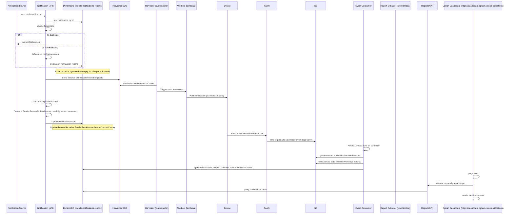

# Reports

The Reports API is used by the [Ophan Dashboard](https://dashboard.ophan.co.uk/notifications) to show data about when notifications were sent and the number of deliveries per platform.

## Reporting Flow

Below is a flow diagram showing the actors and interactions required to report on sent notifications.

There is more going on than just what's described in the diagram (specifically around how notification data is ingested into the ophan data lake). However, this diagram should cover the components most relevant to mobile people.

